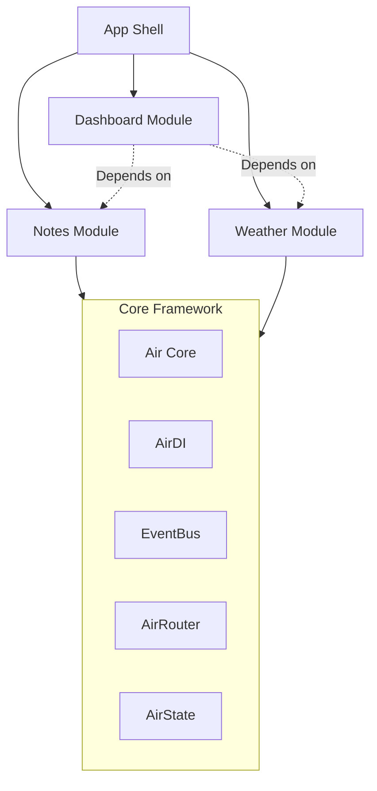

Air Framework is designed for scalability and maintainability. It promotes a **Modular Monolith** architecture where features are developed as independent modules but deployed as a single application.

## High-Level Architecture

The framework acts as a central orchestrator that manages the lifecycle of various modules and provides core services like Dependency Injection, Routing, and an Event Bus.

## Key Pillars

### 1. Modularity

Everything is a module. Modules are self-contained, meaning they contain their own UI, business logic, and even their own routes. This prevents the "Big Ball of Mud" where everything is tightly coupled.

### 2. Reactive State

State management is handled per module. By using the `@GenerateState` pattern, we achieve unidirectional data flow (Pulse -> State -> Flow -> UI) and fine-grained reactivity.

### 3. Explicit Communication

Modules do not call each other directly. They communicate via:

- **Dependency Injection**: One module can request a service registered by another.
- **Event Bus**: Modules emit and listen to events and signals.

### 4. Decoupled Routing

Routing is distributed across modules. The framework aggregates these routes into a single `go_router` configuration at runtime.
