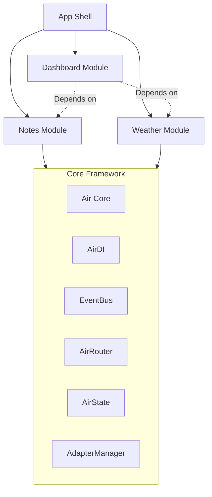
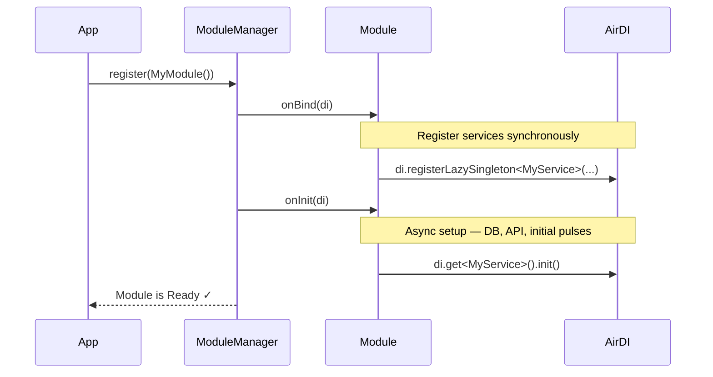

Air Framework is designed for scalability and maintainability. It promotes a **Modular Monolith** architecture where features are developed as independent modules but deployed as a single application.

## High-Level Architecture

The framework acts as a central orchestrator that manages the lifecycle of various modules and provides core services like Dependency Injection, Routing, and an Event Bus.


```mermaid
graph TD
    App[App Shell] --> Notes[Notes Module]
    App --> Weather[Weather Module]
    App --> Dash[Dashboard Module]

    Dash -.->|Depends on| Notes
    Dash -.->|Depends on| Weather

    subgraph CoreF [Core Framework]
    Core[Air Core]
    DI[AirDI]
    Bus[EventBus]
    Router[AirRouter]
    State[AirState]
    Adapters[AdapterManager]
    end

    Notes --> CoreF
    Weather --> CoreF
```

## Key Pillars

### 1. Modularity

Everything is a module. Modules are self-contained, meaning they contain their own UI, business logic, and even their own routes. This prevents the "Big Ball of Mud" where everything is tightly coupled.

### 2. Adapters

Infrastructure services (HTTP, analytics, error tracking) are integrated via **Adapters** — headless components that register abstract contracts in `AirDI`. Modules depend on these contracts, never on the underlying library. This enables swapping implementations without touching module code. See the [Adapters guide](/core/adapters/) for details.

### 3. Reactive State

State management is handled per module. By using the `@GenerateState` pattern, we achieve unidirectional data flow (Pulse -> State -> Flow -> UI) and fine-grained reactivity.

### 4. Explicit Communication

Modules do not call each other directly. They communicate via:

- **Dependency Injection**: One module can request a service registered by another.
- **Event Bus**: Modules emit and listen to events and signals.
## Module Lifecycle

The `ModuleManager` orchestrates every module through a strict sequence:


```mermaid
sequenceDiagram
    participant App
    participant ModuleManager
    participant Module
    participant AirDI

    App->>ModuleManager: register(MyModule())
    ModuleManager->>Module: onBind(di)
    Note over Module,AirDI: Register services synchronously
    Module->>AirDI: di.registerLazySingleton<MyService>(...)
    ModuleManager->>Module: onInit(di)
    Note over Module,AirDI: Async setup — DB, API, initial pulses
    Module->>AirDI: di.get<MyService>().init()
    ModuleManager-->>App: Module is Ready ✓
```

## Before / After: Adding a Feature

Without Air Framework, adding a new feature means touching shared files, introducing hidden coupling, and breaking existing tests. With Air Framework, each feature is fully isolated.

**❌ Before — Unstructured**

```dart
// main.dart — grows unbounded
void main() {
  final authService = AuthService();
  final catalogService = CatalogService(authService); // tight coupling!
  final cartService = CartService(catalogService);
  // ...every new feature requires touching main.dart
}
```

**✅ After — Air Framework**

```dart
// main.dart — stays minimal forever
void main() async {
  WidgetsFlutterBinding.ensureInitialized();
  configureAirState();

  await ModuleManager().register([
    AuthModule(),
    CatalogModule(), // owns its own DI, routes, and state
    CartModule(),    // declares 'catalog:^1.0.0' as a dependency
  ]);

  runApp(MaterialApp.router(routerConfig: AirRouter().router));
}
```

Each module brings its own services, routes, and state. `main.dart` never grows — new features are just new modules registered in the list.
