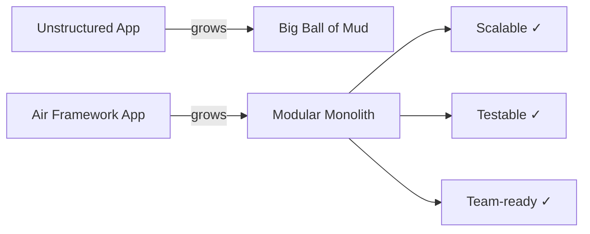

import { Card, CardGrid } from "@astrojs/starlight/components";

Every Flutter team eventually faces the same scaling problems: growing files, tangled dependencies, and features that break other features. Air Framework was built to solve these from day one.

## The Problem With Unstructured Flutter Apps

As a Flutter app grows, three pain points surface consistently:

1. **Big Ball of Mud**: Business logic leaks into widgets. State is scattered. One change breaks something unrelated.
2. **Team Contention**: Two developers can't work on the same feature area without stepping on each other's changes.
3. **Untestable Code**: Logic is buried inside `StatefulWidget.build`, impossible to unit test.

## How Air Framework Solves This

Air Framework enforces **strict module boundaries** from day one. Each feature is an isolated module — with its own state, routes, services, and dependencies — that can be developed, tested, and deployed independently.

## Comparison: Air vs. Common Approaches

| Criterion | No Architecture | Provider / Riverpod | BLoC | **Air Framework** |
| --------- | :-------------: | :-----------------: | :--: | :---------------: |
| **Module isolation** | ❌ | ⚠️ Partial | ⚠️ Partial | ✅ Enforced |
| **Dependency injection** | ❌ | ⚠️ Provider tree | ❌ Manual | ✅ Scoped AirDI |
| **Code generation** | ❌ | ❌ | ❌ | ✅ `@GenerateState` |
| **Lifecycle hooks** | ❌ | ❌ | ❌ | ✅ onBind / onInit |
| **Inter-module comms** | ❌ | ❌ | ❌ | ✅ EventBus |
| **Permission system** | ❌ | ❌ | ❌ | ✅ Built-in |
| **AI agent skills** | ❌ | ❌ | ❌ | ✅ `air skills install` |
| **Routing ownership** | ❌ | ❌ | ⚠️ | ✅ Per-module routes |
| **Standalone state** | ❌ | ✅ | ✅ | ✅ `air_state` pkg |

> **Legend**: ✅ First-class support · ⚠️ Possible with extra effort · ❌ Not provided

## When to Use Air Framework

<CardGrid>
  <Card title="Multi-team projects" icon="puzzle">
    When two or more teams need to own separate feature areas without merge
    conflicts or tight coupling.
  </Card>
  <Card title="Long-lived applications" icon="rocket">
    When you plan to maintain the app for years and need clean boundaries that
    prevent architectural decay.
  </Card>
  <Card title="Enterprise requirements" icon="shield">
    When you need auditable permissions, scoped service registries, and
    enterprise-grade separation of concerns.
  </Card>
  <Card title="AI-assisted development" icon="star">
    When you use AI coding agents — the skill system gives them instant
    framework knowledge so they generate correct code from day one.
  </Card>
</CardGrid>

## What Air Framework Is NOT

- **Not a UI library**: It doesn't replace Material or Cupertino components.
- **Not a networking library**: Use your preferred HTTP client via an [Adapter](/core/adapters/).
- **Not opinionated about backend**: Works with any REST, GraphQL, or Firebase backend.

Air Framework is the **structure layer** — the architectural skeleton that keeps everything else organized as your app grows.
