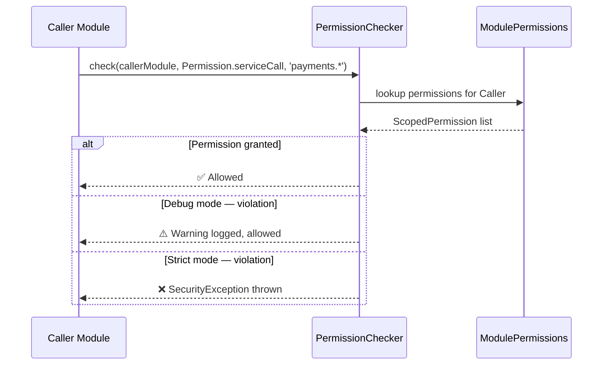

Air Framework provides a robust security layer designed to manage interactions between modules, especially useful in enterprise environments.

## Permission System

The framework uses a declarative permission system. Each module can declare what actions it is allowed to perform.

### 1. Define Permissions

```dart
const authPermissions = ModulePermissions([
  ScopedPermission(Permission.dataRead),
  ScopedPermission(Permission.dataWrite, 'user.*'),
  ScopedPermission(Permission.serviceCall, 'auth.*'),
]);

PermissionChecker().registerModule('auth', authPermissions);
```

### 2. Enforcement Modes

- **Debug Mode (Default)**: Permission violations only log a **Yellow Warning** to the console but allow the action to proceed. This ensures fast development.
- **Strict Mode**: Violations throw a `SecurityException`. Enable this in production:
  ```dart
  PermissionChecker().enable(); // Enable strict enforcement
  ```

## Secure Service Registry

Instead of registering services directly in the DI, you can use the `SecureServiceRegistry` to restrict who can call your services.

```dart
SecureServiceRegistry().registerService(
  name: 'payments.process',
  ownerModuleId: 'payments',
  service: (amount) => _process(amount),
  allowedCallers: ['checkout'], // Only 'checkout' module can call this
);
```

## Secure Data with TTL

You can store shared data that automatically expires after a certain time.

```dart
SecureServiceRegistry().setSecureData<String>(
  'auth.token',
  'jwt-content',
  callerModuleId: 'auth',
  ttl: Duration(hours: 2),
);
```

## Permission Enum

All available permission types in `air_framework`:

| Permission | Description |
| ---------- | ----------- |
| `Permission.dataRead` | Read any module's shared data |
| `Permission.dataWrite` | Write to another module's data scope |
| `Permission.serviceCall` | Call a service registered by another module |
| `Permission.eventEmit` | Emit events via the EventBus |
| `Permission.eventSubscribe` | Subscribe to another module's events |
| `Permission.uiNavigate` | Trigger navigation to routes owned by another module |
| `Permission.configRead` | Read another module's configuration |
| `Permission.configWrite` | Modify another module's configuration |

## Permission Flow



## Security Best Practices

- **Enable strict mode in production**: Call `PermissionChecker().enable()` in release builds to transform warnings into hard errors.
- **Declare minimal permissions**: Only request the specific scopes your module needs — avoid broad wildcards like `'*'`.
- **Use TTL for sensitive data**: Always set a `ttl` on `setSecureData` for tokens, session keys, and PII. A TTL of `Duration.zero` means the data never expires — use this only for non-sensitive static config.
- **Prefer the EventBus over direct service calls**: Cross-module communication via events is decoupled and auditable. Direct `serviceCall` permissions tighten coupling.
- **Audit the Permissions Inspector**: During development, review the Permissions tab in Flutter DevTools to catch unexpected cross-module access before it reaches production.
