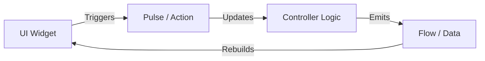

Air Framework uses a strict unidirectional data flow inspired by modern reactive architectures. This pattern is divided into two distinct concepts: **Flows** and **Pulses**.

## Flows (Data)

A **Flow** represents a stream of reactive data. It is the "State" that the UI observes.

- **Nouns**: Flows should be named after the data they represent (e.g., `count`, `userProfile`, `items`).
- **Reactive**: When a Flow's value changes, any `AirView` or `AirBuilder` listening to it will rebuild automatically.
- **Read-Only (UI)**: From the UI perspective, Flows are read-only. You access their current state via the `.value` property.

```dart
// Generated Flow access
final currentCount = CounterFlows.count.value;
```

---

## Pulses (Actions)

A **Pulse** is an event or action that triggers a change in the state. It is how the UI communicates back to the logic.

- **Verbs**: Pulses should be named as actions (e.g., `increment`, `fetchData`, `submitForm`).
- **Asynchronous**: Pulses can be synchronous or asynchronous.
- **Decoupled**: Triggering a pulse doesn't require knowing _how_ the state will change, only _what_ action is being requested.

```dart
// Triggering a Pulse
onPressed: () => CounterPulses.increment.pulse(null),
```

---

## The Cycle of Reactivity

The interaction between Flows and Pulses creates a clean, predictable loop:

1. **Pulse**: The UI triggers a Pulse (Action).
2. **Logic**: The `AirController` handles the Pulse and updates its private fields.
3. **Flow**: The update automatically flows into the public `Flow` (Data).
4. **UI**: `AirView` detects the change and rebuilds the specific part of the screen.



## Why this pattern?

- **Testability**: You can test Pulses and verify Flow outputs without a UI.
- **Performance**: High granularity means only the necessary widgets rebuild.
- **Purity**: No complex state transitions or hidden side effects. Just variables and actions.
